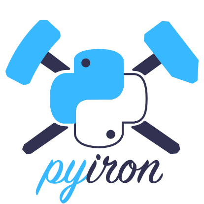

<p align="center"></p>

This is where we host the landing page for [pyiron](https://pyiron.org).

# Notes for developers + maintainers
## In general
The site is rendered using [jekyll](https://jekyllrb.com/), with [hydra](https://jekyll-themes.com/hydra/) as its base theme.
Mostly only superficial changes have been made to the hydra theme to create pyiron.org, so you will likely find everything
you need to know about the site in the documentation for hydra and jekyll.

## Running the server locally
### Install Ruby and Bundler
Bundler is a package manager for Ruby, similar to how Conda works for python.

To install on Mac OS X (ruby is already installed but can still be updated/managed using homebrew if you have it installed):
```
brew install ruby
gem install bundler
```

**(Using Conda)**
Alternatively, for those who want to use conda to configure the ruby environment on Mac OS X:
```
conda install clangxx_osx-64 ruby make rb-jekyll
```
on Linux:
```
conda install gxx_impl_linux-64 ruby make rb-jekyll
```

There is some trouble with installing ruby packages via conda: 
```
Ignoring eventmachine-1.2.7 because its extensions are not built. Try: gem pristine eventmachine --version 1.2.7
Ignoring ffi-1.11.1 because its extensions are not built. Try: gem pristine ffi --version 1.11.1
Ignoring http_parser.rb-0.6.0 because its extensions are not built. Try: gem pristine http_parser.rb --version 0.6.0
Ignoring sassc-2.3.0 because its extensions are not built. Try: gem pristine sassc --version 2.3.0
```
This is probably related to the pinning of the ruby version https://github.com/conda-forge/rb-eventmachine-feedstock/issues/3
but compiling locally seems to work fine. 

And for Mac Users you might have to activate Xcode first:
```
xcode-select --install
xcodebuild -license
```

### Install the website and serve it
```bash
git clone https://github.com/pyiron/pyiron.github.io.git
cd pyiron.github.io
bundle install  # you only have to repeat this if/when you change the underlying site layout.
bundle exec jekyll serve
```
Then go to the website at localhost (127.0.0.1:4000)

_N.B._ When you make changes to most files other than `_config.yml`, the local server will auto-refresh and immediately reflect the changes. For
changes made to `_config.yml` you will have to restart the server.

## Site layout

### `_config.yml`

As with most jekyll sites, a number of general settings can be controlled directly by editing the `_config.yml` file.
This is where we control e.g. the contact email address, the website colors, names of alumni contributors + steering committee, etc.
Variables stored in this file can be accessed in HTML pages using [liquid syntax](https://shopify.github.io/liquid/basics/introduction/),
beginning with the prefix `site.` For example,

```html
<!-- Create a link to write an email to our contact address -->
<p><a href="mailto:{{ site.email }}">{{ site.email }}</a></p>
```

To add a collection of data the site, create a .yml file under `_data/`, like the example collections we currently have in place (`affiliated_projects.yml`, `collaborators.yml`, etc.). Then access them with the liquid prefix `site.data.`:

To create a banner message on the home page (for important messages to share with visitors like workshop registration or site maintenance, etc.), simply set the `alert` variable in `_config.yml` similarly to the example provided in there.

```html
<!-- Create an HTML elemenmt for all the github bots listed for our site -->

	<i class="bot" id="{{ bot }}"></i>

```

### HTML pages
_A quick note about `_layouts/`:_
All active pages on the site inherit their layout from `_layouts/default.html`, so changes made to this file will reflect throughout the entire site.

- **index.html**: pyiron's home page. Customized quite a bit.
- **team/index.html**: Pulls developer names and information from 
- **getting-started/index.html**: Basic instructions for starting and using the MyBinder instance.
- **news/index.html**: New updates for pyiron. Pulls from `news/_posts/`.
- **publications/index.html**: Papers published with pyiron, usually with MyBinder links. Pulls from `publications/_posts/`
- **privacy/index.html**: A very basic GDPR page about how we use visitors' data (we don't use visitors' data).
- **license/index.html**: Information about the license/credits for pyiron and this website.
- **404.html**: Renders when a searched page cannot be found.

### Blogs
the pyiron site technically hosts two blogs: `news` and `publications`. New posts are easy to add to either blog; just create a .md file under e.g. `news/_posts/` based on the examples that are already in there. The filename convention `YYYY-MM-DD-name-of-post.md` is unfortunately quite strict because that's how jekyll orders the posts. If you use a different date format your post will probably not show up.

The 3 most recent posts in `news/` items are also added automatically to the home page.

You can control the number of blog posts shown per page under pyiron.org/news/ and pyiron.org/publications/ by the variable `posts-per-page` in `_config.yml`.

### Stylesheets
The stylesheets for the site are written in Scss (sassy css), under `_sass`. The main colors of the site are stored in `_sass/variables.scss` (they are also stored in `_config.yml`, since these two files apparently cannot transfer variables to each other). Other than that, there is more or less one Scss file for each "main" HTML file, although technically all stylesheets are imported for each page that's based on `default.html`. This is because `default.html` includes `css/screen.scss`, which in turn imports all the Scss files under `_sass`.

However, I have used `_sass/elements.scss` in some places as a kind of "overarching" stylesheet.

### External links
We use external links for the documentation ([readthedocs](https://pyiron.readthedocs.io/en/latest/)), the [MyBinder instance](https://mybinder.org/v2/gh/pyiron/pyiron/master), and the "Imprint" (another GDPR thing; here we just point to MPIE's Imprint page).

### Images
All the main images like our logos are stored in `images/`, except the file `favicon.png` in the root folder, which sets the image shown in browser tabs.

The news cards on the front page are automatically decorated with images based on their category. If a new category is created for a post, a corresponding image (with the name news-icon-category_name.png) should be added to `images/`. Otherwise the default news icon will be used for that post.

### Downloads
Right now there is only one file to download directly from the site:
- `BSD_LICENSE`: The BSD License for pyiron

## Future features (not set up)
### Google analytics
If we ever want to set up google analytics, just add the key to the `_config.yml` file. That's all you should have to do, and it will be added to each page individually. However, we would also have to include some notice of this cookie usage in our privacy statement.
