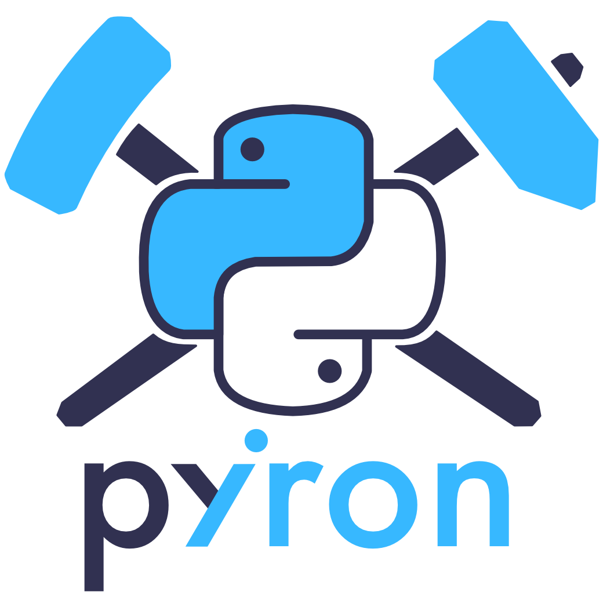

<p align="center"></p>

This is where we host the landing page for [pyiron](https://pyiron.org).

# Notes for developers + maintainers
## In general
The site is rendered using [jekyll](https://jekyllrb.com/), with [hydra](https://jekyll-themes.com/hydra/) as its base theme.
Mostly only superficial changes have been made to the hydra theme to create pyiron.org, so you will likely find everything
you need to know about the site in the documentation for hydra and jekyll.

As with most jekyll sites, very general changes can be made directly in the `_config.yml` file. However, the hydra theme doesn't
customize very much in this file, and only the site.title, site.email, and site.description have been customized in this file for pyiron.

## Running the server locally
### Install Ruby and Bundler
Bundler is a package manager for Ruby, similar to how Conda works for python.

To install on Mac OS X (ruby is already installed but can still be updated/managed using homebrew if you have it installed):
```
brew install ruby
gem install bundler
```

**(Using Conda)**
Alternatively, for those who want to use conda to configure the ruby environment on Mac OS X:
```
conda install clangxx_osx-64 ruby make rb-jekyll
```
on Linux:
```
conda install gxx_impl_linux-64 ruby make rb-jekyll
```

There is some trouble with installing ruby packages via conda: 
```
Ignoring eventmachine-1.2.7 because its extensions are not built. Try: gem pristine eventmachine --version 1.2.7
Ignoring ffi-1.11.1 because its extensions are not built. Try: gem pristine ffi --version 1.11.1
Ignoring http_parser.rb-0.6.0 because its extensions are not built. Try: gem pristine http_parser.rb --version 0.6.0
Ignoring sassc-2.3.0 because its extensions are not built. Try: gem pristine sassc --version 2.3.0
```
This is probably related to the pinning of the ruby version https://github.com/conda-forge/rb-eventmachine-feedstock/issues/3
but compiling locally seems to work fine. 

And for Mac Users you might have to activate Xcode first:
```
xcode-select --install
xcodebuild -license
```

### Install the website and serve it
```bash
git clone https://github.com/pyiron/pyiron.github.io.git
cd pyiron.github.io
bundle install  # you only have to repeat this if/when you change the underlying site layout.
bundle exec jekyll serve
```
Then go to the website at localhost (127.0.0.1:4000)

_N.B._ When you make changes to any file other than `_config.yml`, the local server will auto-refresh and immediately reflect the changes. For
changes made to `_config.yml` you will have to restart the server.

## Site layout
### HTML pages
_A quick note about `_layouts/`:_
All active pages on the site inherit their layout from `_layouts/default.html`, so changes made to this file will reflect throughout
the entire site. The other layouts are important for rendering blog-based pages, which we currently do not use.

- **index.html**: pyiron's home page. Customized quite a bit.
- **about.html**: A brief description of pyiron's features.
- **contact.html**: Sends messages to the address listed in `_config.yaml` using CloudCannon.
- **contact-success.html**: Static page we send people to after they use the contact form.
- **team.html**: Pulls developer names and information from `_staff_members/`. Each dev gets their own .md file, and their images are pulled from the MPIE site.
- **try-pyiron.html**: Basic instructions for starting and using the MyBinder instance.
- **privacy.html**: A very basic GDPR page about how we use visitors' data (we don't use visitors' data).
- **404.html**: Renders when a searched page cannot be found.

### Stylesheets
The stylesheets for the site are written in Scss (sassy css), under `_sass`. The main colors of the site are stored in `_sass/variables.scss`.
Other than that, there is more or less one Scss file for each "main" HTML file, although technically all stylesheets are imported for each
page that's based on `default.html`. This is because `default.html` includes `css/screen.scss`, which in turn imports all the Scss files under `_sass`.

However, I have mostly used `_sass/elements.scss` as a kind of "overarching" stylesheet.

### External links
We use external links for the documentation ([readthedocs](https://pyiron.readthedocs.io/en/latest/)), the
[MyBinder instance](https://mybinder.org/v2/gh/pyiron/pyiron/master), and the "Imprint" (another GDPR thing;
here we just point to MPIE's Imprint page).

### Downloads
Right now there are only two files to download directly from the site:
- `LICENSE`: The BSD License for pyiron
- `images/qr-code.png`: a QR code that sends you to the homepage.

## Future features (not set up)
### Google analytics
If we ever want to set up google analytics, just add the key to the `_config.yml` file. That's all you should have to do, and it will be added
to each page individually. However, we would also have to include some notice of this cookie usage in our privacy statement.

### Blog posts
To add a blog post, just create a .md file under `_posts/` based on the examples that are already in there. I think the filename is
important because that's how jekyll orders the posts, so it should have the format "YYYY-MM-DD-name-of-post.md". Then just make sure we
link to the blog somewhere on the site (the posts are listed chronologically at the url "/blog").
